# 🚀 Enterprise CI/CD Training Materials

> **Production-Ready Docker & CI/CD Training Platform**
> A comprehensive collection of enterprise-grade demos showcasing containerization, automated testing, and progressive CI/CD pipelines with real-world strictness escalation.

## 📊 Quick Overview

```mermaid
graph TB
    subgraph "🏗️ What You'll Learn"
        A[Docker Best Practices] --> B[Multi-Stage Builds]
        A --> C[Security Hardening]
        A --> D[Container Testing]

        E[CI/CD Pipelines] --> F[GitHub Actions]
        E --> G[Progressive Strictness]
        E --> H[Automated Deployment]

        I[Enterprise Patterns] --> J[96%+ Test Coverage]
        I --> K[Security Scanning]
        I --> L[Branch Protection]
    end

    style A fill:#2196f3,color:#ffffff
    style E fill:#ff9800,color:#ffffff
    style I fill:#9c27b0,color:#ffffff
```



## 🎯 Purpose & Learning Objectives

This repository provides **hands-on, production-ready examples** for engineers learning Docker containerization and enterprise CI/CD practices. Each demo represents real-world scenarios with actual challenges and solutions.

### What Makes This Training Unique

- **🔄 Progressive CI/CD Strictness**: Experience realistic quality gates (90% → 95% → 96%+)
- **🛡️ Security-First Approach**: Mandatory secret detection, container scanning, SAST
- **📈 Real Coverage Metrics**: Actual achieved coverage (96.33%), not theoretical 100%
- **🚀 Production Simulation**: Test vehicles, staging deployments, emergency hotfixes

## 🏗️ Repository Architecture


## 🔄 Git Workflow & CI/CD Pipeline

### Branch Strategy with Progressive Quality Gates


### CI/CD Pipeline Architecture


## 📋 Progressive CI/CD Requirements

### Escalating Quality Standards by Branch


| Branch Level | Coverage Required | Security Requirements | Build Time | Deployment Target |
|-------------|------------------|----------------------|------------|-------------------|
| **feature/** | ≥90% | Pre-commit + SAST | ~5 min | Test Bench (on-demand) |
| **develop** | ≥95% | + Container Scanning | ~10 min | Test Vehicles (daily) |
| **main** | ≥96% | + Zero Vulnerabilities | ~15 min | Production (immediate) |

## 🚀 Demo Projects Overview

### Current Production-Ready Demos


### TypeScript API Demo Details

- **Technology**: Express.js, TypeScript, Zod validation
- **Coverage**: 96.33% lines, 96.87% functions
- **Features**: CRUD API, rate limiting, health monitoring
- **Security**: Helmet, CORS, input validation, secret detection
- **Container**: Multi-stage Alpine Linux, distroless runtime

### C++ HTTP Server Demo Details

- **Technology**: Modern C++17, libmicrohttpd, CMake
- **Features**: RESTful API, task management, health checks
- **Security**: Memory safety, stack protection, minimal attack surface
- **Container**: Multi-stage build, Alpine base, production optimized

## 🛡️ Security Framework

### Multi-Layer Security Architecture


## 🚦 Getting Started

### Prerequisites

```bash
# Required Tools
- Docker Desktop or Docker Engine 20+
- Git 2.30+
- Node.js 18+ (for TypeScript demo)
- CMake 3.20+ (for C++ demo)
- GitHub CLI (gh) for PR workflows
```

### 🔒 Mandatory Security Setup (2 Commands)

```bash
# REQUIRED - Installs pre-commit hooks for secret detection
pip install pre-commit && pre-commit install
```

> ⚠️ **This is NON-NEGOTIABLE** - Prevents accidental secret commits

### Quick Start Guide


```bash
# 1. Clone repository
git clone https://github.com/mvalancy-mt/training-materials.git
cd training-materials

# 2. Install security hooks (MANDATORY)
pip install pre-commit && pre-commit install

# 3. Create feature branch
git checkout develop
git checkout -b feature/my-improvement

# 4. Test TypeScript demo
cd demos/typescript-api
npm install
npm test  # Should see 96.33% coverage

# 5. Make your changes and commit
git add .
git commit -m "feat: Add awesome improvement"

# 6. Push and create PR
git push -u origin feature/my-improvement
gh pr create --base develop --title "Add awesome improvement"
```

## 📊 Real-World Metrics & Achievements

### Coverage Statistics (Actual Production Values)


| Metric | Target | Achieved | Status |
|--------|--------|----------|--------|
| Line Coverage | 96% | 96.33% | ✅ Exceeds |
| Function Coverage | 96% | 96.87% | ✅ Exceeds |
| Statement Coverage | 96% | 96.00% | ✅ Meets |
| Branch Coverage | 75% | 82.25% | ✅ Exceeds |

## 🔄 Workflow Examples

### Feature Development Flow

```bash
# ALWAYS start from develop
git checkout develop
git pull origin develop

# Create feature branch
git checkout -b feature/new-endpoint

# IMMEDIATELY push to track remotely
git push -u origin feature/new-endpoint

# Work iteratively with frequent commits
echo "Working on new endpoint" > PROGRESS.md
git add . && git commit -m "docs: Start new endpoint work"
git push

# Implement feature
# ... make changes ...
git add . && git commit -m "feat: Add endpoint structure"
git push

# ... more changes ...
git add . && git commit -m "test: Add endpoint tests"
git push

# Create PR when ready (triggers CI)
gh pr create --base develop \
  --title "feat: Add new endpoint" \
  --body "Implements new /api/v2/endpoint with full test coverage"

# After merge, clean up immediately
git checkout develop
git pull origin develop
git branch -d feature/new-endpoint
git push origin --delete feature/new-endpoint
```

### Emergency Hotfix Flow

```bash
# Hotfix branches from main
git checkout main
git pull origin main
git checkout -b hotfix/critical-security-fix

# Apply fix with tests
# ... fix issue ...
git add . && git commit -m "fix: Patch critical security vulnerability"
git push -u origin hotfix/critical-security-fix

# Direct PR to main (ultra-strict CI)
gh pr create --base main \
  --title "HOTFIX: Critical security patch" \
  --body "Fixes CVE-2024-XXXX with immediate production deployment"

# After merge, sync to develop
git checkout develop
git pull origin main
git push origin develop
```

## 📚 Documentation Structure

| Document | Purpose | Audience |
|----------|---------|----------|
| [README.md](README.md) | Overview & quick start | All developers |
| [SETUP.md](SETUP.md) | Detailed environment setup | New team members |
| [CONTRIBUTING.md](CONTRIBUTING.md) | Contribution guidelines | Contributors |
| [CI-REQUIREMENTS.md](docs/CI-REQUIREMENTS.md) | Complete CI/CD specifications | DevOps engineers |
| Demo READMEs | Language-specific guides | Demo users |

## 🎯 Learning Path


## 🤝 Contributing

We welcome contributions! Please see [CONTRIBUTING.md](CONTRIBUTING.md) for guidelines.

### Contribution Checklist

- [ ] Pre-commit hooks installed
- [ ] Tests pass locally with required coverage
- [ ] Documentation updated
- [ ] PR created to `develop` (not `main`)
- [ ] CI checks passing
- [ ] Code reviewed

## 📄 License

This project is licensed under the MIT License - see [LICENSE](LICENSE) for details.

## 🙋 Support & Questions

- **Issues**: [GitHub Issues](https://github.com/mvalancy-mt/training-materials/issues)
- **Discussions**: [GitHub Discussions](https://github.com/mvalancy-mt/training-materials/discussions)
- **Security**: Report vulnerabilities privately via GitHub Security tab

---

<div align="center">

**Built with ❤️ for Enterprise CI/CD Training**

*Demonstrating real-world patterns, not theoretical perfection*

</div>
