# 🔷 C++ HTTP Server - Production CI/CD Demo

**High-performance C++20 HTTP server with enterprise-grade CI/CD pipeline**

## 🎯 Overview

A high-performance C++ HTTP server demonstrating production-ready CI/CD practices with comprehensive testing, security scanning, and automated deployments.

```mermaid
graph TB
    subgraph "🚀 C++ Demo Features"
        A[C++20 HTTP Server] --> B[libmicrohttpd]
        A --> C[RESTful API]
        A --> D[Memory Safety]

        E[Enterprise Performance] --> F[Zero-Copy Operations]
        E --> G[Thread Safety]
        E --> H[Connection Pooling]

        I[Security Hardening] --> J[Stack Protection]
        I --> K[PIE Executable]
        I --> L[Sanitizers]

        M[Production Ready] --> N[Docker Multi-Stage]
        M --> O[Health Checks]
        M --> P[Graceful Shutdown]
    end

    style A fill:#e1f5fe
    style E fill:#fff3e0
    style I fill:#ffebee
    style M fill:#e8f5e9
```

## 🏗️ Features

- **RESTful API**: Complete task management API with CRUD operations
- **High Performance**: Built with libmicrohttpd for optimal performance
- **Memory Safety**: Modern C++20 with RAII, smart pointers, and sanitizers
- **Security Hardened**: Stack protection, position independent executable
- **Comprehensive Testing**: Unit tests with address/undefined behavior sanitizers
- **Production Ready**: Multi-stage Docker builds, health checks, graceful shutdown

## 📡 API Endpoints

### API Architecture

```mermaid
graph LR
    subgraph "🌐 HTTP Server Endpoints"
        A[Client Request] --> B{Route}

        B -->|Health| C[/health]
        B -->|Health| D[/health/ready]
        B -->|Health| E[/health/live]
        B -->|Health| F[/health/metrics]

        B -->|API| G[/api/v1/tasks]
        B -->|API| H[/api/v1/tasks/{id}]
        B -->|API| I[/api/v1/tasks/stats/summary]

        C --> J[Basic Status]
        D --> K[Readiness Probe]
        E --> L[Liveness Probe]
        F --> M[Performance Metrics]

        G --> N[CRUD Operations]
        H --> N
        I --> O[Statistics]
    end

    style A fill:#e3f2fd
    style J fill:#4caf50,color:#fff
    style K fill:#2196f3,color:#fff
    style L fill:#ff9800,color:#fff
    style N fill:#9c27b0,color:#fff
```

### Health & Monitoring
- `GET /health` - Basic health check
- `GET /health/ready` - Readiness probe
- `GET /health/live` - Liveness probe
- `GET /health/metrics` - System metrics

### Task Management
- `GET /api/v1/tasks` - List all tasks (with filtering & pagination)
- `GET /api/v1/tasks/{id}` - Get specific task
- `POST /api/v1/tasks` - Create new task
- `PUT /api/v1/tasks/{id}` - Update task
- `DELETE /api/v1/tasks/{id}` - Delete task
- `GET /api/v1/tasks/stats/summary` - Task statistics

## 🚀 Quick Start


### Development Environment Setup

```mermaid
flowchart TB
    subgraph "🛠️ Local Development"
        A[Install Dependencies] --> A1[build-essential]
        A --> A2[cmake, pkg-config]
        A --> A3[libmicrohttpd-dev]
        A --> A4[libjsoncpp-dev, libssl-dev]

        B[Build Process] --> B1[mkdir build && cd build]
        B1 --> B2[cmake -DCMAKE_BUILD_TYPE=Debug]
        B2 --> B3[make -j$(nproc)]

        C[Validation] --> C1[make test]
        C1 --> C2[Unit Tests + Sanitizers]
        C2 --> C3[./http_server 8000]
    end

    style A fill:#bbdefb
    style B fill:#c8e6c9
    style C fill:#fff9c4
```

### Development (Local)

```bash
# Install dependencies (Ubuntu/Debian)
sudo apt-get update
sudo apt-get install -y build-essential cmake pkg-config \
    libmicrohttpd-dev libjsoncpp-dev libssl-dev

# Build and run
mkdir build && cd build
cmake -DCMAKE_BUILD_TYPE=Debug ..
make -j$(nproc)

# Run tests
make test

# Start server
./http_server 8000
```

### Production Deployment

```mermaid
flowchart TB
    subgraph "🐳 Docker Production"
        A[Multi-Stage Build] --> A1[Alpine Build Environment]
        A1 --> A2[C++20 Compilation]
        A2 --> A3[Static Analysis]

        B[Production Runtime] --> B1[Minimal Base Image]
        B1 --> B2[Non-root User]
        B2 --> B3[Health Checks]

        C[Container Features] --> C1[Port 8000]
        C --> C2[Graceful Shutdown]
        C --> C3[Resource Limits]

        A3 --> B1
    end

    style A1 fill:#e3f2fd
    style B1 fill:#e8f5e9
    style C1 fill:#fff3e0
```

### Production (Docker)

```bash
# Build container
docker build -t cpp-http-server:latest .

# Run container
docker run -d -p 8000:8000 --name http-server cpp-http-server:latest

# Health check
curl http://localhost:8000/health
```

## 🔧 Development Workflow

### Production-Ready Branching Strategy

```mermaid
flowchart TB
    subgraph "🔄 Enterprise Development Flow"
        A[Start: git checkout develop] --> B[Create feature branch]
        B --> C[Local development & testing]
        C --> D[Push feature branch]
        D --> E[🧪 Auto-deploy to Test Bench]

        E --> F[Create PR to develop]
        F --> G[95% Coverage CI]
        G --> H{CI Passes?}

        H -->|No| I[Fix issues]
        I --> C
        H -->|Yes| J[Merge to develop]
        J --> K[🚛 Test Vehicle Flash - 6 AM Daily]

        K --> L[Create PR to main]
        L --> M[Ultra-Strict CI - 100%]
        M --> N{Production Ready?}

        N -->|No| O[Address failures]
        O --> K
        N -->|Yes| P[🚀 Production Deployment]
    end

    style E fill:#fff3e0
    style K fill:#2196f3,color:#fff
    style P fill:#4caf50,color:#fff
```

### Deployment Pipeline by Branch


This project follows the **production-ready branching strategy**:

```bash
# Create feature branch
git checkout develop
git checkout -b feature/new-endpoint

# Make changes and test locally
mkdir build && cd build
cmake -DCMAKE_BUILD_TYPE=Debug ..
make test

# Push feature branch (deploys to test bench)
git push -u origin feature/new-endpoint
# ⚡ Automatically deployed to: testbench-new-endpoint.internal.com

# Create PR to develop (comprehensive CI)
gh pr create --base develop --title "Add new endpoint"
# ⚡ Triggers 95% coverage requirement, security scans

# After merge to develop (test vehicle deployment)
# ⚡ Next day at 6 AM: flashed to all test vehicles

# Release to production
gh pr create --base main --title "Release v1.1.0"
# ⚡ Ultra-strict CI: 100% coverage, zero vulnerabilities
```

## 🏗️ Architecture

### System Architecture Overview


### Component Interaction


### Core Components

```cpp
namespace http_server {
    class HttpServer {
        // Main HTTP server using libmicrohttpd
        // Thread-safe request handling
        // Graceful shutdown support
    };

    class TaskManager {
        // Thread-safe task CRUD operations
        // In-memory storage with atomic operations
        // Statistics and filtering support
    };

    class HealthCheck {
        // System health monitoring
        // Kubernetes-ready probes
        // Performance metrics
    };
}
```

### Security Architecture

```mermaid
graph TB
    subgraph "🛡️ Multi-Layer C++ Security"
        subgraph "Memory Safety"
            A[Modern C++20] --> A1[RAII Patterns]
            A --> A2[Smart Pointers]
            A --> A3[Stack Protection]
            A --> A4[PIE Executable]
        end

        subgraph "Runtime Security"
            B[AddressSanitizer] --> B1[Memory Leak Detection]
            B --> B2[Buffer Overflow Protection]
            C[UBSan] --> C1[Undefined Behavior Detection]
            C --> C2[Integer Overflow Checks]
        end

        subgraph "Build Security"
            D[Static Analysis] --> D1[cppcheck]
            D --> D2[clang-static-analyzer]
            E[Dependency Scanning] --> E1[Vulnerability Database]
            E --> E2[Known CVE Checks]
        end

        subgraph "Container Security"
            F[Non-root User] --> F1[Unprivileged Execution]
            F --> F2[Minimal Permissions]
            G[Hardened Runtime] --> G1[Read-only Filesystem]
            G --> G2[Capability Dropping]
        end
    end

    style A fill:#e3f2fd
    style B fill:#fff3e0
    style D fill:#e8f5e9
    style F fill:#ffebee
```

### Security Features

- **Memory Safety**: Modern C++20 with RAII patterns
- **Stack Protection**: `-fstack-protector-strong` compilation flag
- **Position Independent**: PIE executable for ASLR
- **Sanitizers**: AddressSanitizer and UBSan in debug builds
- **Dependency Scanning**: Automated vulnerability checks
- **Non-root Container**: Runs as unprivileged user

### Performance Architecture

```mermaid
graph TB
    subgraph "🚄 High-Performance Design"
        A[Zero-Copy Operations] --> A1[Efficient String Handling]
        A --> A2[JSON Processing]
        A --> A3[Memory Pool Reuse]

        B[Thread Safety] --> B1[Lockless Operations]
        B --> B2[Atomic Variables]
        B --> B3[Thread-Local Storage]

        C[Connection Management] --> C1[HTTP Keep-Alive]
        C --> C2[Connection Pooling]
        C --> C3[Resource Reuse]

        D[Compiler Optimizations] --> D1[-O3 Release Builds]
        D --> D2[Link-Time Optimization]
        D --> D3[NDEBUG Production]
    end

    style A fill:#4caf50,color:#fff
    style B fill:#2196f3,color:#fff
    style C fill:#ff9800,color:#fff
    style D fill:#9c27b0,color:#fff
```

### Performance Optimizations

- **Zero-Copy**: Efficient string handling and JSON processing
- **Thread Safety**: Lockless operations where possible
- **Connection Pooling**: Efficient HTTP connection management
- **Release Builds**: `-O3` optimization with NDEBUG

## 🧪 Testing Strategy

### Testing Pipeline Overview

```mermaid
flowchart TB
    subgraph "🔬 Comprehensive Testing Framework"
        A[Unit Tests] --> A1[GoogleTest Framework]
        A --> A2[Mock Objects]
        A --> A3[Edge Case Coverage]

        B[Memory Safety] --> B1[AddressSanitizer]
        B --> B2[UndefinedBehaviorSanitizer]
        B --> B3[Memory Leak Detection]

        C[Integration Tests] --> C1[Container Health Tests]
        C --> C2[API Endpoint Validation]
        C --> C3[Error Handling Tests]

        D[Performance Tests] --> D1[Apache Bench - ab]
        D --> D2[wrk Load Testing]
        D --> D3[Stress Testing]
    end

    style A fill:#e1f5fe
    style B fill:#ffebee
    style C fill:#e8f5e9
    style D fill:#fff3e0
```

### Coverage Requirements by Branch

```mermaid
graph LR
    subgraph "📈 Progressive Testing Standards"
        A[feature/*<br/>≥90% Coverage] --> B[develop<br/>≥95% Coverage]
        B --> C[main<br/>≥100% Coverage]

        A1[Basic CI + Sanitizers] --> B1[+ Integration Tests]
        B1 --> C1[+ Zero Vulnerabilities]

        A2[HIL Test Bench] --> B2[Test Vehicle Fleet]
        B2 --> C2[Production Ready]
    end

    style A fill:#bbdefb
    style B fill:#90caf9
    style C fill:#64b5f6
```

### Unit Tests
```bash
# Run all tests with sanitizers
cd build
make test

# Run with coverage
cmake -DCMAKE_BUILD_TYPE=Debug -DENABLE_COVERAGE=ON ..
make test
lcov --capture --directory . --output-file coverage.info
```

### Integration Tests
```bash
# Container health tests
docker run -d -p 8000:8000 cpp-http-server:latest
./scripts/integration-tests.sh
```

### Performance Testing

```mermaid
graph TB
    subgraph "🚄 Performance Validation"
        A[Load Testing] --> A1[Apache Bench]
        A1 --> A2[10,000 requests]
        A2 --> A3[100 concurrent]

        B[Stress Testing] --> B1[wrk Tool]
        B1 --> B2[12 threads]
        B2 --> B3[400 connections]
        B3 --> B4[30 second duration]

        C[Metrics Collection] --> C1[Response Times]
        C --> C2[Throughput]
        C --> C3[Error Rates]
        C --> C4[Resource Usage]
    end

    style A1 fill:#4caf50,color:#fff
    style B1 fill:#2196f3,color:#fff
    style C fill:#ff9800,color:#fff
```

### Performance Tests
```bash
# Load testing
ab -n 10000 -c 100 http://localhost:8000/api/v1/tasks
wrk -t12 -c400 -d30s http://localhost:8000/health
```

## 🚢 CI/CD Pipeline

### Pipeline Architecture

```mermaid
flowchart TB
    subgraph "🔄 Enterprise C++ CI/CD Pipeline"
        subgraph "Feature Branch - ⚡ Basic CI (90%)"
            A[Code Push] --> A1[CMake Build]
            A1 --> A2[Unit Tests + Sanitizers]
            A2 --> A3[90% Coverage Check]
            A3 --> A4[Static Analysis]
            A4 --> A5[🧪 HIL Test Bench Deploy]
        end

        subgraph "Develop Branch - ✅ Comprehensive CI (95%)"
            B[PR to Develop] --> B1[All Basic Checks]
            B1 --> B2[Integration Tests]
            B2 --> B3[95% Coverage Check]
            B3 --> B4[Container Security Scan]
            B4 --> B5[Performance Benchmarks]
            B5 --> B6[🚛 Test Vehicle Flash (6 AM)]
        end

        subgraph "Main Branch - 🚨 Ultra-Strict CI (100%)"
            C[PR to Main] --> C1[All Previous Checks]
            C1 --> C2[100% Coverage Check]
            C2 --> C3[Zero Vulnerabilities]
            C3 --> C4[Production Simulation]
            C4 --> C5[🚀 Field-Ready Deploy]
        end
    end

    style A5 fill:#fff3e0
    style B6 fill:#2196f3,color:#fff
    style C5 fill:#4caf50,color:#fff
```

### Security Scanning Matrix


### Branch Strategy
- **feature/***: HIL test bench deployment, basic CI (90% coverage)
- **develop**: Test vehicle firmware flash daily, comprehensive CI (95% coverage)
- **main**: Production deployment, ultra-strict CI (100% coverage, zero vulnerabilities)

### Security Scanning
- **Static Analysis**: cppcheck, clang-static-analyzer
- **Dynamic Analysis**: AddressSanitizer, UBSan, Valgrind
- **Dependency Scanning**: Known vulnerability database checks
- **Container Scanning**: Trivy security analysis
- **Secret Detection**: Multi-pattern credential scanning

### Deployment Targets
- **Test Benches**: Automatic HIL deployment for feature branches
- **Test Vehicles**: Daily firmware flash from develop branch
- **Production**: Field-ready deployment from main branch

## 📊 Monitoring & Observability

### Health Check Architecture

```mermaid
flowchart TB
    subgraph "🏥 Health Monitoring System"
        A[Health Endpoints] --> A1[GET /health]
        A1 --> A2[Basic Server Status]

        A --> A3[GET /health/ready]
        A3 --> A4[Kubernetes Readiness]

        A --> A5[GET /health/live]
        A5 --> A6[Kubernetes Liveness]

        A --> A7[GET /health/metrics]
        A7 --> A8[System Performance]

        B[Monitoring Data] --> B1[Memory Usage %]
        B --> B2[CPU Utilization]
        B --> B3[Active Connections]
        B --> B4[Request/Response Times]
        B --> B5[Thread Pool Status]
    end

    style A2 fill:#4caf50,color:#fff
    style A4 fill:#2196f3,color:#fff
    style A6 fill:#ff9800,color:#fff
    style A8 fill:#9c27b0,color:#fff
```

### Performance Metrics Dashboard


### Health Endpoints
- `GET /health` - Returns 200 if server is running
- `GET /health/ready` - Kubernetes readiness probe
- `GET /health/live` - Kubernetes liveness probe
- `GET /health/metrics` - System performance metrics

### Metrics Available
- Memory usage and CPU utilization
- Request count and response times
- Active connections and thread pool status
- Task statistics and database health

## 🚀 Production Deployment

### Production Readiness Pipeline

```mermaid
flowchart LR
    subgraph "📦 Production Deployment Process"
        A[main branch commit] --> B[Ultra-Strict CI]
        B --> C[100% Test Coverage]
        C --> D[Zero Vulnerabilities]
        D --> E[Performance Validation]
        E --> F[Container Registry]
        F --> G[Kubernetes Deploy]
        G --> H[🌟 Field Ready]
    end

    style A fill:#e1f5fe
    style D fill:#4caf50,color:#fff
    style H fill:#ff5722,color:#fff
```

### Container Registry
```bash
# Tag for production
docker tag cpp-http-server:latest registry.company.com/cpp-http-server:v1.0.0
docker tag cpp-http-server:latest registry.company.com/cpp-http-server:latest

# Deploy to production (from main branch only)
kubectl set image deployment/cpp-http-server app=registry.company.com/cpp-http-server:latest
```

### Zero-Notice Deployment Standards

```mermaid
graph TB
    subgraph "✅ Production Quality Gates"
        A[100% Test Coverage] --> A1[All Tests Pass]
        B[Zero Vulnerabilities] --> B1[Security Validated]
        C[Hardware Tested] --> C1[Test Vehicle Fleet]
        D[Performance Benchmarks] --> D1[Load Test Passed]
        E[Field Ready] --> E1[Customer Deployable]

        A1 --> F[🚀 Production Deploy]
        B1 --> F
        C1 --> F
        D1 --> F
        E1 --> F
    end

    style F fill:#4caf50,color:#fff
```

Every commit to `main` is **immediately field-deployable**:
- 100% test coverage validated
- Zero security vulnerabilities
- Tested on real hardware (test vehicles)
- Performance benchmarks passed
- Ready for customer environments

**Main branch = Production ready. No exceptions.** 🚀

## 🎓 Learning Objectives

### C++ Learning Path

```mermaid
flowchart TB
    subgraph "🎯 C++ HTTP Server Learning Journey"
        A[Start Here] --> B[1. Environment Setup]
        B --> C[2. Build System - CMake]
        C --> D[3. Modern C++20 Features]
        D --> E[4. libmicrohttpd Integration]
        E --> F[5. Memory Safety & RAII]
        F --> G[6. Testing with Sanitizers]
        G --> H[7. Performance Optimization]
        H --> I[8. Docker Containerization]
        I --> J[9. CI/CD Pipeline]
        J --> K[10. Production Deployment]

        L[Advanced Topics] --> L1[Thread Safety]
        L --> L2[Zero-Copy Operations]
        L --> L3[Hardware Integration]
        L --> L4[Field Deployment]
    end

    style A fill:#4caf50,color:#fff
    style K fill:#ff9800,color:#fff
    style L4 fill:#d32f2f,color:#fff
```

### Core Knowledge Areas

```mermaid
graph TB
    subgraph "📚 C++ Enterprise Development"
        subgraph "Modern C++ Concepts"
            A[C++20 Features] --> A1[RAII Patterns]
            A --> A2[Smart Pointers]
            A --> A3[Move Semantics]
            A --> A4[Template Metaprogramming]
        end

        subgraph "System Programming"
            B[HTTP Server Design] --> B1[libmicrohttpd]
            B --> B2[Thread Management]
            B --> B3[Memory Management]
            B --> B4[Error Handling]
        end

        subgraph "Performance & Security"
            C[Zero-Copy Operations] --> C1[String Optimization]
            C --> C2[Memory Pool Management]
            D[Security Hardening] --> D1[Stack Protection]
            D --> D2[Address Sanitizers]
        end

        subgraph "Enterprise DevOps"
            E[CMake Build System] --> E1[Cross-platform Builds]
            F[Container Security] --> F1[Multi-stage Docker]
            G[CI/CD Integration] --> G1[Progressive Testing]
            H[Production Deployment] --> H1[Zero-downtime Updates]
        end
    end

    style A fill:#e1f5fe
    style B fill:#e8f5e9
    style C fill:#fff3e0
    style E fill:#f3e5f5
```

### Practical Skills Development

- **Modern C++20**: RAII patterns, smart pointers, move semantics
- **HTTP Server Architecture**: libmicrohttpd integration, request handling
- **Memory Safety**: AddressSanitizer, UBSan, memory leak detection
- **Thread Safety**: Atomic operations, lockless programming
- **Performance Optimization**: Zero-copy operations, connection pooling
- **Build Systems**: CMake configuration, cross-platform compilation
- **Container Security**: Multi-stage builds, hardened runtime
- **Enterprise CI/CD**: Progressive testing, hardware integration
