# 🔷 TypeScript API Demo - Comprehensive CI/CD Training

**Modern TypeScript/Node.js API with enterprise-grade CI/CD pipeline**

## 🎯 Overview

This TypeScript API demo demonstrates comprehensive CI/CD practices for modern Node.js applications, featuring:

- **Express.js REST API** with TypeScript, Zod validation, and comprehensive error handling
- **Enterprise Security** with Helmet, CORS, rate limiting, and input validation
- **96.33% Test Coverage** with Jest, supertest, and comprehensive test suites
- **Docker Multi-Stage Build** with distroless runtime and security hardening
- **Escalating CI/CD Pipeline** with branch-specific strictness levels


## 🏗️ Architecture

### Application Structure

```mermaid
flowchart TB
    subgraph "📁 TypeScript API Structure"
        A[src/app.ts<br/>Express.js Server] --> B[src/controllers/<br/>task-controller.ts]
        A --> C[src/middleware/<br/>security.ts]
        A --> D[src/utils/<br/>health.ts]

        B --> E[src/models/<br/>task.ts - Zod Schemas]

        F[tests/<br/>Test Suites] --> G[96.33% Coverage]

        H[Docker/<br/>Multi-Stage] --> I[Alpine Build Stage]
        H --> J[Distroless Runtime]
    end

    style A fill:#1976d2,color:#ffffff
    style B fill:#2e7d32,color:#ffffff
    style F fill:#f9a825,color:#ffffff
    style H fill:#ad1457,color:#ffffff
```



### Core Components

- **Express.js Application** (`src/app.ts`) - Main application server
- **Task Management API** (`src/controllers/task-controller.ts`) - RESTful task operations
- **Zod Data Models** (`src/models/task.ts`) - Type-safe request/response validation
- **Security Middleware** (`src/middleware/security.ts`) - Comprehensive security controls
- **Health Monitoring** (`src/utils/health.ts`) - Application health and readiness checks

### API Endpoints


| Method | Endpoint | Description |
|--------|----------|-------------|
| GET | `/health` | Application health status |
| GET | `/ready` | Readiness probe for Kubernetes |
| GET | `/api/v1/tasks` | List all tasks (with filtering) |
| POST | `/api/v1/tasks` | Create new task |
| GET | `/api/v1/tasks/:id` | Get task by ID |
| PUT | `/api/v1/tasks/:id` | Update existing task |
| DELETE | `/api/v1/tasks/:id` | Delete task |
| GET | `/api/v1/tasks/stats` | Task statistics |

## 🚀 Quick Start


### Prerequisites
- Node.js 18+ (recommended: 20)
- Docker (optional)
- Git

### Local Development Workflow

```mermaid
flowchart TB
    subgraph "🛠️ Development Setup"
        A[cd demos/typescript-api] --> B[npm install]
        B --> C[cp .env.example .env]
        C --> D[npm run dev]
        D --> E[🌐 http://localhost:3000]

        F[Health Check] --> G[🏥 /health endpoint]
        F --> H[🎯 /ready endpoint]

        I[API Testing] --> J[📝 /api/v1/tasks]
        I --> K[📊 /api/v1/tasks/stats]
    end

    style A fill:#ffecb3
    style E fill:#c8e6c9
    style G fill:#bbdefb
    style H fill:#bbdefb
```



```bash
cd demos/typescript-api

# Install dependencies
npm install

# Create environment file
cp .env.example .env

# Start development server
npm run dev

# API available at: http://localhost:3000
# Health check: http://localhost:3000/health
```

### Testing & Quality Assurance

```mermaid
graph TB
    subgraph "🧪 Quality Pipeline"
        A[npm run test:coverage] --> B[96.33% Coverage]
        C[npm run typecheck] --> D[TypeScript Validation]
        E[npm run lint] --> F[ESLint Security]
        G[npm run format:check] --> H[Code Formatting]

        B --> I[Quality Gate ✅]
        D --> I
        F --> I
        H --> I
    end

    style A fill:#fff9c4
    style B fill:#c8e6c9
    style I fill:#4caf50,color:#fff
```



```bash
# Run all tests with coverage
npm run test:coverage

# Type checking
npm run typecheck

# Code formatting
npm run format:check

# ESLint analysis
npm run lint

# Production build
npm run build
npm start
```

### Docker Deployment

```mermaid
flowchart TB
    subgraph "🐳 Docker Deployment"
        A[docker-compose up --build] --> B[Multi-Stage Build]
        B --> C[Alpine Build Stage]
        B --> D[Distroless Runtime]

        E[Production Ready] --> F[🌐 Port 3000]
        E --> G[🔒 Security Hardened]
        E --> H[📊 Health Monitoring]

        I[Optional Monitoring] --> J[Prometheus Stack]
        I --> K[🔍 Metrics UI]
    end

    style A fill:#e3f2fd
    style D fill:#c8e6c9
    style G fill:#ffcdd2
```



```bash
# Build and run with docker-compose
docker-compose up --build

# API available at: http://localhost:3000
# With monitoring: docker-compose --profile monitoring up
```

## 🔒 Security Features


### Built-in Security Controls

- **Helmet.js Integration** - Security headers (CSP, HSTS, X-Frame-Options)
- **CORS Configuration** - Cross-origin resource sharing controls
- **Rate Limiting** - Request throttling (100 requests/minute)
- **Input Validation** - Zod schema validation for all endpoints
- **Error Handling** - Secure error responses without information leakage

### Container Security

- **Distroless Runtime** - No shell, package manager, or unnecessary tools
- **Non-Root User** - Application runs as unprivileged user
- **Read-Only Filesystem** - Container filesystem is read-only
- **Security Capabilities** - All Linux capabilities dropped
- **Multi-Stage Build** - Minimal attack surface

## 📊 Testing Strategy

### Test Coverage by Branch Type


### Current Coverage Achievement


| Branch Type | Coverage Requirement | Current Status |
|-------------|---------------------|----------------|
| Feature Branches | ≥90% line coverage | ✅ 96.33% |
| Develop Branch | ≥95% line coverage | ✅ 96.33% |
| Main Branch | ≥96% line coverage | ✅ 96.33% |

### Test Suite Architecture


### Test Categories

- **Unit Tests** (`tests/task.test.ts`) - API endpoint testing
- **Security Tests** (`tests/security.test.ts`) - Security middleware validation
- **Health Tests** (`tests/health.test.ts`) - Health check functionality
- **Coverage Tests** (`tests/complete-coverage.test.ts`) - Edge case validation
- **Integration Tests** - Full API workflow testing

```bash
# Run specific test suites
npm test -- --testPathPattern=task.test.ts
npm test -- --testPathPattern=security.test.ts
npm test -- --testPathPattern=health.test.ts

# Watch mode for development
npm test -- --watch
```

## 🚢 CI/CD Pipeline

### Escalating Pipeline Architecture

```mermaid
flowchart TB
    subgraph "🔄 Progressive CI/CD Pipeline"
        subgraph "Feature Branch CI - ⚡ Basic (90%)"
            A[Code Push] --> A1[Lint & Format]
            A1 --> A2[Unit Tests]
            A2 --> A3[90% Coverage Check]
            A3 --> A4[Basic Security Scan]
            A4 --> A5[✅ Merge to Develop]
        end

        subgraph "Develop Branch CI - ✅ Comprehensive (95%)"
            B[PR to Develop] --> B1[All Basic Checks]
            B1 --> B2[Multi-Node Testing]
            B2 --> B3[95% Coverage Check]
            B3 --> B4[Container Security Scan]
            B4 --> B5[Integration Tests]
            B5 --> B6[✅ Ready for Main]
        end

        subgraph "Main Branch CI - 🚨 Ultra-Strict (96%+)"
            C[PR to Main] --> C1[All Previous Checks]
            C1 --> C2[96%+ Coverage Check]
            C2 --> C3[Zero Vulnerabilities]
            C3 --> C4[Production Simulation]
            C4 --> C5[Performance Tests]
            C5 --> C6[🚀 Production Deploy]
        end
    end

    style A5 fill:#4caf50,color:#fff
    style B6 fill:#2196f3,color:#fff
    style C6 fill:#ff5722,color:#fff
```



### Pipeline Stages by Branch

| Branch | Stage | Requirements | Duration |
|--------|-------|-------------|----------|
| `feature/*` | ⚡ **Basic CI** | 90% coverage, basic security | ~5 min |
| `develop` | ✅ **Comprehensive CI** | 95% coverage, enhanced security, multi-node testing | ~10 min |
| `main` | 🚨 **Ultra-Strict CI** | 96%+ coverage, zero vulnerabilities, production simulation | ~15 min |

### CI/CD Feature Matrix

```mermaid
graph TB
    subgraph "🛠️ CI/CD Capabilities"
        A[Multi-Node Testing] --> A1[Node.js 18, 20, 21]
        B[Security Pipeline] --> B1[Secret Detection]
        B --> B2[Dependency Scan]
        B --> B3[Container Scan - Trivy]
        B --> B4[SAST Analysis]

        C[Quality Gates] --> C1[Progressive Coverage]
        C --> C2[TypeScript Strict]
        C --> C3[ESLint Security]
        C --> C4[Prettier Format]

        D[Production Readiness] --> D1[Docker Build Test]
        D --> D2[Health Check Validation]
        D --> D3[Performance Benchmarks]
        D --> D4[Zero-Downtime Deploy]
    end

    style A1 fill:#e1f5fe
    style B4 fill:#ffebee
    style C1 fill:#e8f5e9
    style D4 fill:#fff3e0
```



### Key CI/CD Features

- **Multi-Node Testing** - Node.js 18, 20, 21 compatibility
- **Advanced Secret Detection** - TypeScript-specific pattern matching
- **Container Security Scanning** - Trivy vulnerability analysis
- **Production Simulation** - Full deployment testing
- **Quality Metrics** - Code analysis and build optimization

## 🐳 Docker Architecture

### Multi-Stage Build Visualization

```mermaid
flowchart TB
    subgraph "🏗️ Docker Multi-Stage Build"
        subgraph "Stage 1: Build Environment"
            A[node:20-alpine] --> A1[npm install]
            A1 --> A2[TypeScript Compilation]
            A2 --> A3[npm prune --production]
            A3 --> A4[Build Artifacts]
        end

        subgraph "Stage 2: Production Runtime"
            B[gcr.io/distroless/nodejs20] --> B1[Copy /dist]
            B1 --> B2[Copy node_modules]
            B2 --> B3[Non-root User: 1001]
            B3 --> B4[Read-only Filesystem]
            B4 --> B5[Health Check Integration]
        end

        A4 --> B1

        subgraph "Security Features"
            C[No Shell] --> C1[No Package Manager]
            C1 --> C2[No Debug Tools]
            C2 --> C3[Minimal Attack Surface]
        end

        B5 --> C
    end

    style A fill:#bbdefb
    style B fill:#c8e6c9
    style C fill:#ffcdd2
```



### Container Security Architecture

```mermaid
graph TB
    subgraph "🔒 Security Layers"
        A[Base Image Security] --> A1[Distroless Runtime]
        A1 --> A2[No Shell/Package Manager]
        A2 --> A3[Minimal Dependencies]

        B[Runtime Security] --> B1[Non-root User: 1001]
        B1 --> B2[Read-only Filesystem]
        B2 --> B3[Dropped Capabilities]

        C[Network Security] --> C1[Port 3000 Only]
        C1 --> C2[Health Check Endpoint]
        C2 --> C3[Graceful Shutdown]

        D[Build Security] --> D1[Multi-stage Optimization]
        D1 --> D2[Production Dependencies Only]
        D2 --> D3[Vulnerability Scanning]
    end

    style A1 fill:#e8f5e9
    style B1 fill:#fff3e0
    style C1 fill:#e3f2fd
    style D1 fill:#fce4ec
```



### Multi-Stage Build Process

```dockerfile
# Stage 1: Build Environment (node:20-alpine)
- Install dependencies
- TypeScript compilation
- Dependency pruning

# Stage 2: Production Runtime (distroless/nodejs20)
- Copy build artifacts only
- Non-root user execution
- Minimal attack surface
```

### Container Features

- **Health Checks** - Built-in container health monitoring
- **Security Hardening** - Distroless base, capability restrictions
- **Resource Optimization** - Multi-stage build for minimal image size
- **Production Ready** - Environment-based configuration

## 📈 Performance & Monitoring

### Health Monitoring Architecture


### Application Health Response

```mermaid
graph LR
    subgraph "🏥 Health Check Response"
        A[GET /health] --> B{System Status}

        B -->|Healthy| C[Memory < 90%]
        B -->|Degraded| D[Memory 90-95%]
        B -->|Unhealthy| E[Memory > 95%]

        C --> F[200 OK Response]
        D --> G[200 Degraded Response]
        E --> H[503 Unhealthy Response]

        I[Response Includes:] --> J[Uptime: seconds]
        I --> K[Version: 1.0.0]
        I --> L[Memory: used/total/%]
        I --> M[Environment: production]
    end

    style C fill:#4caf50,color:#fff
    style D fill:#ff9800,color:#fff
    style E fill:#f44336,color:#fff
```



### Application Metrics

```bash
# View application metrics
curl http://localhost:3000/health

# Example response:
{
  "success": true,
  "data": {
    "status": "healthy",
    "uptime": 125.432,
    "version": "1.0.0",
    "environment": "production",
    "memory": {
      "used": 45672448,
      "total": 67108864,
      "percentage": 68
    }
  }
}
```

### Optional Prometheus Integration

```mermaid
flowchart LR
    subgraph "📊 Monitoring Stack Deployment"
        A[docker-compose --profile monitoring up] --> B[Prometheus Server]
        B --> C[Metrics Scraping]
        C --> D[Time-series DB]

        E[Application] --> F[/health endpoint]
        F --> G[Metrics Export]
        G --> C

        H[Grafana] --> I[Dashboard UI]
        I --> J[Real-time Charts]
        J --> K[Alert Notifications]
    end

    style B fill:#e65100,color:#fff
    style H fill:#f57c00,color:#fff
    style K fill:#d32f2f,color:#fff
```

```bash
# Start with monitoring stack
docker-compose --profile monitoring up

# Prometheus UI: http://localhost:9090
# Grafana UI: http://localhost:3001
```

## 🔧 Development Workflow

### Development Lifecycle


### Code Quality Pipeline


### Code Quality Standards

- **TypeScript Strict Mode** - Ultra-strict type checking enabled
- **ESLint Security Rules** - Security-focused linting with `eslint-plugin-security`
- **Prettier Formatting** - Consistent code formatting
- **Pre-commit Hooks** - Secret detection and formatting validation

### Branch Protection Strategy

```bash
# Standard development workflow
git checkout develop
git pull origin develop           # Sync with develop
git checkout -b feature/new-api   # Create feature branch
git push -u origin feature/new-api # Push first (SOP)

# Development cycle
npm run dev                       # Local development
npm run test:coverage            # Validate changes
git commit -m "feat: add new API endpoint"

# CI pipeline automatically runs based on branch strictness level
```

## 🎓 Learning Objectives

### Learning Path

```mermaid
flowchart TB
    subgraph "🎯 TypeScript API Learning Journey"
        A[Start Here] --> B[1. Environment Setup]
        B --> C[2. Run Demo Locally]
        C --> D[3. Explore API Endpoints]
        D --> E[4. Examine Test Coverage]
        E --> F[5. Study Security Features]
        F --> G[6. Docker Deployment]
        G --> H[7. CI/CD Pipeline]
        H --> I[8. Make Your Own Changes]

        J[Branch Exercises] --> J1[Feature Branch - Basic CI]
        J1 --> J2[Develop Branch - Comprehensive CI]
        J2 --> J3[Main Branch - Ultra-Strict CI]

        K[Advanced Topics] --> K1[Container Security]
        K --> K2[Production Monitoring]
        K --> K3[Performance Optimization]
    end

    style A fill:#4caf50,color:#fff
    style I fill:#ff9800,color:#fff
    style J3 fill:#d32f2f,color:#fff
```

### Knowledge Areas

```mermaid
graph TB
    subgraph "📚 Core Learning Areas"
        subgraph "TypeScript/Node.js"
            A[Strict Type Checking] --> A1[Type Safety]
            B[Express.js APIs] --> B1[RESTful Design]
            C[Zod Validation] --> C1[Schema-based Validation]
            D[Error Handling] --> D1[Secure Responses]
        end

        subgraph "Testing & Quality"
            E[Jest Testing] --> E1[96.33% Coverage]
            F[Supertest] --> F1[API Integration Tests]
            G[Security Testing] --> G1[Middleware Validation]
            H[Health Checks] --> H1[Monitoring Tests]
        end

        subgraph "DevOps & Deployment"
            I[Docker Multi-Stage] --> I1[Production Optimization]
            J[CI/CD Pipeline] --> J1[Progressive Strictness]
            K[Security Scanning] --> K1[Trivy Integration]
            L[Container Hardening] --> L1[Distroless Runtime]
        end
    end

    style A1 fill:#e1f5fe
    style E1 fill:#4caf50,color:#fff
    style I1 fill:#fff3e0
```

### TypeScript/Node.js Concepts

- Modern TypeScript with strict type checking
- Express.js REST API development
- Zod schema validation and type safety
- Comprehensive error handling patterns
- Security middleware implementation

### CI/CD Concepts

- Escalating pipeline strictness by branch
- Multi-version compatibility testing
- Container security scanning with Trivy
- Test coverage requirements and validation
- Production deployment simulation

### Docker Concepts

- Multi-stage builds for optimization
- Distroless containers for security
- Health check implementation
- Container orchestration with docker-compose
- Security hardening techniques

## 🛡️ Security Best Practices

### Code Security
- Input validation with Zod schemas
- Rate limiting and CORS protection
- Security headers with Helmet.js
- Environment variable management

### Container Security
- Distroless runtime environment
- Non-root user execution
- Minimal attack surface
- Regular vulnerability scanning

### CI/CD Security
- Advanced secret detection patterns
- Zero-vulnerability policies for production
- Container image signing (production)
- Security audit automation

---

## 📚 Additional Resources

- [TypeScript Handbook](https://www.typescriptlang.org/docs/)
- [Express.js Security Best Practices](https://expressjs.com/en/advanced/best-practice-security.html)
- [Docker Security Best Practices](https://docs.docker.com/develop/security-best-practices/)
- [Jest Testing Framework](https://jestjs.io/docs/getting-started)

**This demo provides a comprehensive foundation for enterprise TypeScript API development with production-ready CI/CD practices.**
